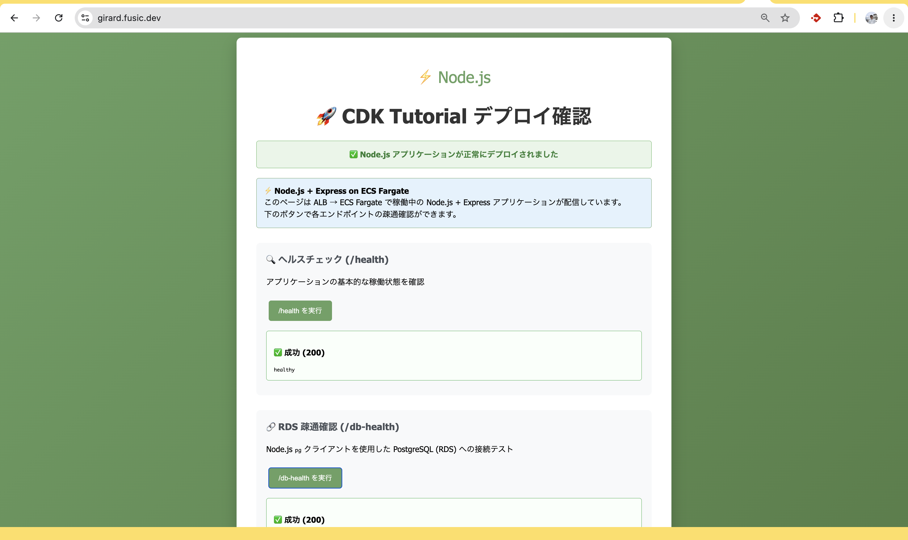

# Step 05 — Webアプリに RDS 疎通確認機能を追加する

step04 では ALB + HTTPS で Web アプリを公開した。  
このステップでは **RDS (PostgreSQL)** を追加し、Web アプリの `/db-health` エンドポイントから DB 接続を確認できるようにする。

```
step04                                step05
──────                                ──────
Route53 → ALB → Fargate              Route53 → ALB → Fargate
                                                        ↓
                                               RDS (PostgreSQL)
                                             (Private Isolated Subnet)
```



---

## 1. VPC にプライベート隔離サブネットを追加する

RDS は **`PRIVATE_ISOLATED` サブネット**（NAT ゲートウェイなし・インターネット経路なし）に置く。  
step04 では Public / Private の 2 種類だったサブネットに `Isolated` を追加する。

[infra/lib/constructs/vpc.ts](../infra/lib/constructs/vpc.ts)

```ts
subnetConfiguration: [
    { cidrMask: 24, name: 'Public',   subnetType: ec2.SubnetType.PUBLIC },
    { cidrMask: 24, name: 'Private',  subnetType: ec2.SubnetType.PRIVATE_WITH_EGRESS },
    { cidrMask: 24, name: 'Isolated', subnetType: ec2.SubnetType.PRIVATE_ISOLATED }, // ← 追加
],
```

---

## 2. RDS インスタンスの Construct を作る

## 3. ECS タスクに DB 接続情報を渡す

Secrets Manager に保管された RDS シークレットから `host` と `password` を取り出して、  
ECS タスクの環境変数として注入する。

[infra/lib/constructs/load_balanced_fargate_service.ts](../infra/lib/constructs/load_balanced_fargate_service.ts)

```ts
taskImageOptions: {
    image: appImageAsset,
    containerPort: 3000,
    secrets: {
        DATABASE_HOST:     ecs.Secret.fromSecretsManager(rdsSecret, 'host'),
        DATABASE_PASSWORD: ecs.Secret.fromSecretsManager(rdsSecret, 'password'),
    },
},
```

---

## 4. Node.js アプリに `/db-health` エンドポイントを追加する

このステップのゴールは、ブラウザ上の「`/db-health を実行`」ボタンから、
RDS への接続結果（成功/失敗と PostgreSQL バージョン）を確認できるようにすること。

### 4.1 `server.js` を修正する

[server.js](../server.js) に PostgreSQL 接続設定と `/db-health` エンドポイントを追加する。

```js
const dbConfig = () => ({
  host: process.env.DATABASE_HOST,
  port: 5432,
  database: 'postgres',     // PostgreSQL がデフォルトで作る postgres DB に接続
  user: 'postgres',
  password: process.env.DATABASE_PASSWORD,
  ssl: { rejectUnauthorized: false },  // RDS は SSL 必須
});
```

### 4.2 `index.html` に確認ボタンを追加する

[index.html](../index.html) に `/db-health` を呼び出すボタンを追加して、  
ブラウザから RDS への疎通確認ができるようにする。

---

## 5. ローカルでの動作確認

ローカル環境では RDS（Private Isolated Subnet）に到達できないため、  
`/db-health` はエラーになる。`/health` のみ確認する。

```bash
docker build --platform=linux/arm64 -t cdk-tutorial-app:latest .
docker run --rm -p 3000:3000 cdk-tutorial-app:latest
# → http://localhost:3000 で /health が OK なら OK
```

---

## 6. デプロイ

```bash
cd infra
cdk deploy
```

デプロイ完了後、ブラウザで `/db-health` を実行して、200レスポンスが返れば成功。
Web アプリの画面だけで、アプリ経由の DB 疎通確認が完結する。

---

## 7. ローカルから RDS に接続する（ecspresso portforward）

ECS タスクを踏み台にして、手元の PC から RDS に直接接続できる。  
詳細は [ecspresso/usage.md](../ecspresso/usage.md) を参照。

### 9.1 `portforward_db.sh` を追加する

[ecspresso/staging/portforward_db.sh](../ecspresso/staging/portforward_db.sh)

```bash
# RDS の host は cdk deploy 後に更新する
cd `dirname $0`
ecspresso exec portforward --local-port 8888 --port 5432 --host <RDSホスト名>
```

RDS ホスト名は Secrets Manager の自動生成シークレットから `host` を取得して反映する。aws コンソールから確認できる

```bash
# ポートフォワードを起動（RDS ホスト名は Secrets Manager から取得）
ecspresso/staging/portforward_db.sh

# 別ターミナルで psql 接続
psql -h localhost -p 8888 -U postgres -d postgres
```

---

## 構成まとめ

```
Route53 → ALB (HTTPS:443) → ECS Fargate (Node.js + Express)
                                      ↓ (TCP 5432 / SSL)
                             RDS PostgreSQL 18
                             (Private Isolated Subnet)
                                      ↑
                             Secrets Manager
                             (host / password を ECS タスクに注入)
```

| レイヤー | 変更内容 |
|---|---|
| VPC | `PRIVATE_ISOLATED` サブネットを追加 |
| RDS | `rds.ts` Construct を新規作成 |
| パラメータ | `DatabaseConfig` 型と staging 設定を追加 |
| ECS タスク | Secrets Manager 経由で `DATABASE_HOST` / `DATABASE_PASSWORD` を注入 |
| アプリ | `pg` を追加、`/db-health` エンドポイントを実装 |
| UI | `index.html` に `/db-health` ボタンを追加 |
