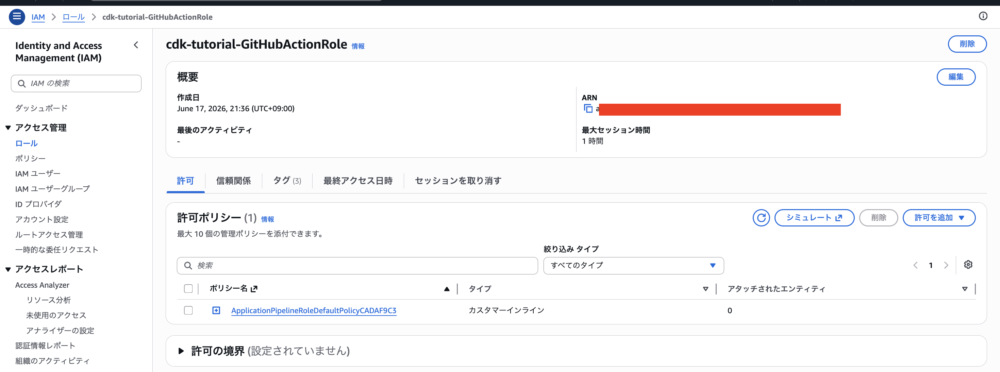
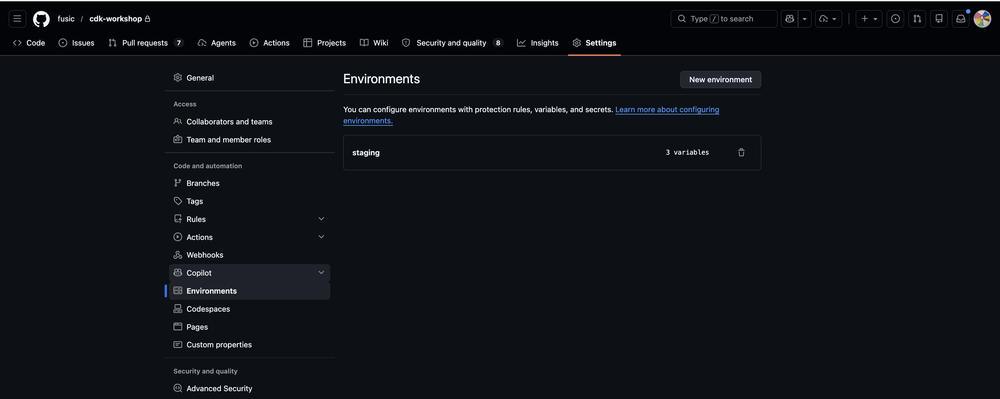
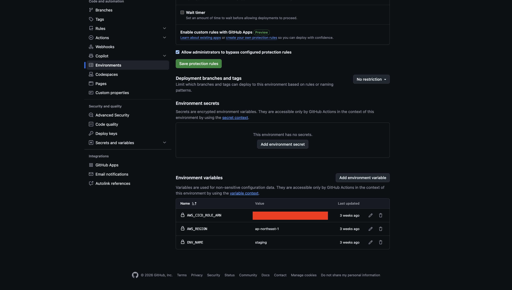

# Step 06 — GitHub Actions で自動デプロイパイプラインを構築する

step05 まで完成したアプリを、これからは **staging にgit push するだけで自動的に ECS に反映される**パイプラインを構築する。

手動デプロイの流れ（step05 まで）：
```
git push → git clone → cdk deploy（またはecspresso deploy）→ ECS に反映
```

自動デプロイの流れ（step06）：
```
git push → GitHub Actions → S3 → CodePipeline → CodeBuild → ECS に反映（自動）
```

---

## 概要

**step05 までのコード + ApplicationPipeline Construct** をデプロイすることで、以下のリソースが AWS に自動作成される：

- **S3 バケット** — GitHub Actions が zip ファイルを upload する場所
- **CodePipeline** — S3 の source.zip が置かれると自動起動
- **CodeBuild** — Docker build/push を実行
- **GitHub OIDC ロール** — GitHub Actions が AWS リソースにアクセスするためのロール

step06 コード（[infra/lib/constructs/app_pipeline.ts](../infra/lib/constructs/app_pipeline.ts) 追加、[infra/lib/stack/cdk-tutorial-stack.ts](../infra/lib/stack/cdk-tutorial-stack.ts) 変更）はまず merge / git pull してください。

---

## セットアップ手順

### 1. CDK をデプロイ

```bash
cd infra
cdk deploy
```

### 2. AWS IAM コンソールで設定を確認

AWS コンソール → IAM → ロール → `cdk-tutorial-GitHubActionRole` を検索



**信頼ポリシー（Trust relationship）** タブで以下の設定を確認：

```json
"StringLike": {
  "token.actions.githubusercontent.com:sub": ["repo:perugo/cdk-tutorial:*"]
}
```

**重要**：`repo:perugo/cdk-tutorial` がご自身の GitHub リポジトリ（owner/name）と一致するように修正してください。

### 3. GitHub Environments を設定

GitHub → Settings → Environments → `staging`



**Environment variables** に以下を追加：



| 名前 | 値 | 備考 |
|---|---|---|
| `AWS_REGION` | `ap-northeast-1` | CDK を deploy したリージョン |
| `ENV_NAME` | `staging` | 環境名（parameter.ts の envName と同じ） |
| `AWS_CICD_ROLE_ARN` | `arn:aws:iam::...` | 手順 1 でメモした ARN |

---

## デプロイ確認

### 1. ワークフローの S3 バケット名を確認

[.github/workflows/app-deploy.yml](.github/workflows/app-deploy.yml) の以下の部分：

```yaml
aws s3 cp source.zip \
  s3://cdk-${{ vars.ENV_NAME }}-app-source-${{ env.REPOSITORY_NAME }}/source.zip
```

この S3 バケット名が、CDK デプロイ時の **SourceCodeBucket** と一致していることを確認してください。

### 2. git push して動作確認

```bash
git add .
git commit -m "Add CI/CD pipeline"
git push origin staging
```

GitHub → Actions タブで workflow が実行されることを確認：

1. **Zip and upload** — source.zip が S3 に置かれる
2. **AWS CodePipeline が自動起動**（AWS Console → CodePipeline 確認）
3. **CodeBuild で Docker build/push** が実行される
4. **ECS が自動更新** される

---

## よくあるエラー

### `Not authorized to perform sts:AssumeRoleWithWebIdentity`

**原因：** GitHub Environment の `AWS_CICD_ROLE_ARN` が正しくない、または trust policy が `repo:perugo/cdk-tutorial` 以外に設定されている

**対処：**
1. AWS IAM コンソールで trust policy を確認
2. GitHub Environment の `AWS_CICD_ROLE_ARN` を正しい ARN に更新

---

## まとめ

| 手順 | 内容 |
|---|---|
| 1 | CDK deploy（S3 / CodePipeline / CodeBuild / OIDC ロール作成） |
| 3 | GitHub Environment に環境変数設定（AWS_REGION / ENV_NAME / AWS_CICD_ROLE_ARN） |
| 4 | git push で自動デプロイを確認 |

これで `staging` / `production` ブランチへの push が自動的に ECS に反映されます。
