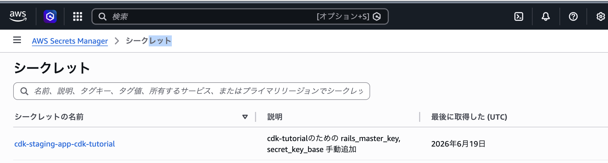
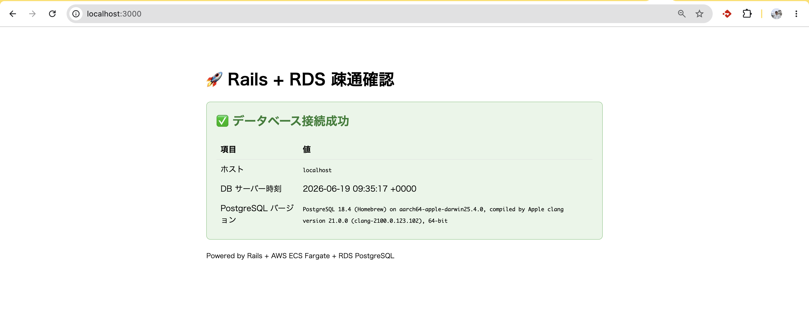
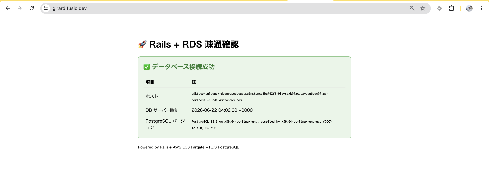

# Step 07 — Node.js アプリを Rails (+ RDS) に置き換える

step05/06 までは **Node.js + Express** のアプリを ECS Fargate にデプロイしていた。
このステップでは、その中身を **Ruby on Rails 8.1** に丸ごと置き換える。インフラ（VPC / ALB / RDS / CI/CD）はそのまま再利用し、**「動くアプリ」だけを差し替える**のがゴール。

```
step06                              step07
──────                              ──────
Route53 → ALB → Fargate            Route53 → ALB → Fargate
            (Node.js)                          (Rails 8.1)
                ↓                                  ↓
            RDS                                RDS
```

---

## このステップで「やること」一覧（先に全体像）

| # | やること | なぜ必要か |
|---|---------|-----------|
| 1 | 旧 Node.js アプリ一式を削除し Rails を初期化 | アプリの実体を入れ替えるため |
| 2 | ローカル PostgreSQL に `postgres/postgres` ロールを作る | `database.yml` の接続情報と一致させるため |
| 3 | 環境別 credentials を生成し AWS に登録 | 本番コンテナが `.enc` を復号できるようにするため |
| 4 | DB 疎通確認用の `home#show` を作る | デプロイ後にブラウザで RDS 接続を確認するため |

---

## 1. 旧アプリを消して Rails を初期化する

step06 までの `index.html` / `server.js` / `package.json` を削除し、リポジトリ直下で Rails を新規生成する。

```bash
rails new . --database=postgresql --skip-test --skip-system-test --skip-kamal
```

---

## 2. ローカル PostgreSQL に `postgres` ロールを作る

`database.yml` が `username: postgres` を要求するのに対し、Homebrew 版 PostgreSQL は **OSユーザー名のロール（例: `noelgirard`）しか作らない**。そのままだと `role "postgres" does not exist` で落ちる。

```bash
# postgres ロールを作成（パスワードも postgres に）
createuser -s postgres
psql postgres -c "ALTER USER postgres WITH PASSWORD 'postgres';"
```

その後、DB 作成とマイグレーション：

```bash
bin/rails db:prepare
```

## 3. credentials を生成して AWS に登録する

Rails の秘密情報は **鍵（`.key`）で暗号化した `.yml.enc`** として扱う。`.enc` だけ git に commit し、鍵は AWS Secrets Manager に預ける。

### 3.1 環境別に credentials を作成

```bash
EDITOR="vim" rails credentials:edit --environment development
EDITOR="vim" rails credentials:edit --environment staging
```

- 初回実行で `config/credentials/<env>.key`（復号鍵・**commit禁止**）と `<env>.yml.enc`（暗号文・**commitする**）が生成される。
- vim が開いたら `secret_key_base` の値を確認する

### 3.2 鍵を Secrets Manager に登録（コンソールで手入力）

ECS は `.key` を持たないので、鍵を環境変数として注入する（[load_balanced_fargate_service.ts](../infra/lib/constructs/load_balanced_fargate_service.ts) が `appSecret` から読み込む）。AWS コンソールから手入力で登録する。

1. **AWS コンソール → Secrets Manager → 新しいシークレットを保存**
2. シークレットのタイプは **「その他のシークレットの種類」** を選択
3. **キー/値のペア**で以下の2つを入力：

   | キー | 値 |
   |------|-----|
   | `rails_master_key` | `config/credentials/staging.key` の中身（`cat` で表示してコピー） |
   | `secret_key_base` | staging credentials に入れた `secret_key_base` |

4. **シークレットの名前**に、[parameter.ts](../infra/parameter.ts) の `appSecretName` と同じ値を入力：

   ```
   cdk-staging-app-cdk-tutorial
   ```

登録後、Secrets Manager のシークレット一覧に以下のように表示されていれば OK：



> シークレット名が `appSecretName` と一致していないと、CDK が `fromSecretNameV2` で参照できずデプロイ・起動に失敗する。
>
> 鍵（`.key`）は**絶対に git に乗せない**（[.gitignore](../.gitignore) で除外済み）。受け渡しは Secrets Manager 経由で行う。

---

## 4. DB 疎通確認ページ（`home#show`）を作る

デプロイ後にブラウザだけで RDS 接続を確認できるよう、トップページに疎通確認を仕込む。
コントローラーで `ActiveRecord::Base.connection` を使って PostgreSQL に問い合わせ、ホスト・サーバー時刻・バージョンを取得して表示する。

ローカルで `bin/rails server` を起動し、`localhost:3000` にアクセスすると以下のように表示される：



---

## デプロイと確認

```bash
cd infra
cdk deploy
```

デプロイ後、ブラウザでトップページを開き「✅ データベース接続成功」と接続先ホスト・PostgreSQL バージョンが表示されれば完了。ローカルと同じ画面が ECS 上の Rails から RDS 経由で返ってくる。


---

このステップで「インフラはそのまま、アプリだけ Node.js → Rails に差し替える」流れが一通り完成する。
